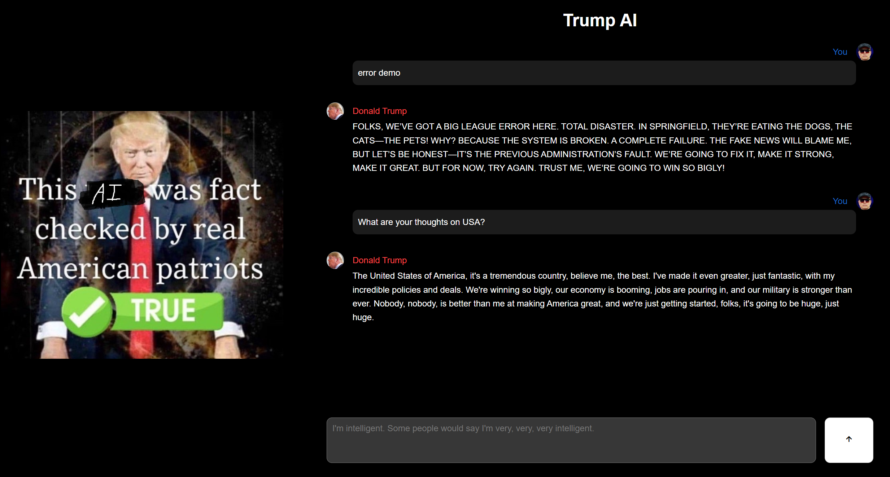

# Trump AI Chatbot

**Available Online**: https://www.l145.be/trump-ai/

This project is a Trump AI Chatbot built with React as frontend and a separate backend in NodeJS (expressjs). The chatbot simulates conversations in the style of President Donald Trump, providing users with an engaging and entertaining experience.



### ⚠️ Important Note

This chatbot is not real and is meant purely for entertainment purposes. It does not reflect actual statements or opinions of Donald Trump.

## Features

- **Realistic Responses**: The chatbot generates responses that mimic the speech patterns and style of Donald Trump.
- **Interactive UI**: Built with React, the user interface is responsive and interactive.
- **Built-in Error Handling**: Ensures a smooth and stable chat experience even when issues arise.
- **Great UI**: Designed to be visually appealing and user-friendly.

## Online Usage

Access Trump AI @ https://www.l145.be/trump-ai/

## Local Usage

To get started with the Trump AI Chatbot (Locally), follow these steps:

### Clone the Repository:
1. Clone the GitHub repository:
    ```bash
    git clone https://github.com/legelff/trump-ai.git
    ```
2. Navigate to the project directory:
    ```bash
    cd trump-ai
    ```

### Setup Environment Variables

1. Create a `.env` file in the backend directory of the project.
2. Add the following line to the `.env` file, replacing `YOUR_GROQ_API_KEY` with your actual API key from [console.groq.com](https://console.groq.com):
    ```plaintext
    GROQ_API_KEY=YOUR_GROQ_API_KEY
    ```

### Frontend Setup

1. Navigate to the frontend directory:
    ```bash
    cd frontend
    ```
2. Install the dependencies:
    ```bash
    npm install
    ```
3. Start the development server:
    ```bash
    npm run dev
    ```

### Backend Setup

1. Navigate to the backend directory:
    ```bash
    cd backend
    ```
2. Install the dependencies:
    ```bash
    npm install
    ```
3. Start the backend server:
    ```bash
    npm run dev
    ```

## Usage

Once both frontend and backend servers are running, open your browser and navigate to `http://localhost:5173/` to start interacting with the Trump AI Chatbot.

## Contact

If you have any questions, suggestions, or just want to have a chat, feel free to reach out:

- Email: business@l145.be
- LinkedIn: [Aryan Shah](https://www.linkedin.com/in/aryan-shah-l145)
- GitHub: [legelff](https://github.com/legelff)